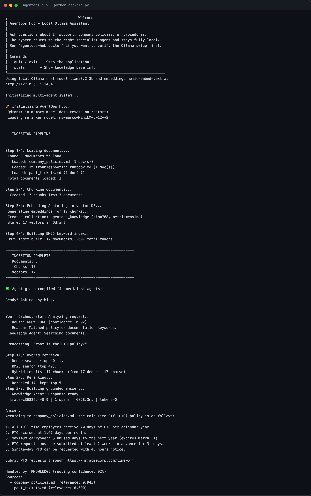
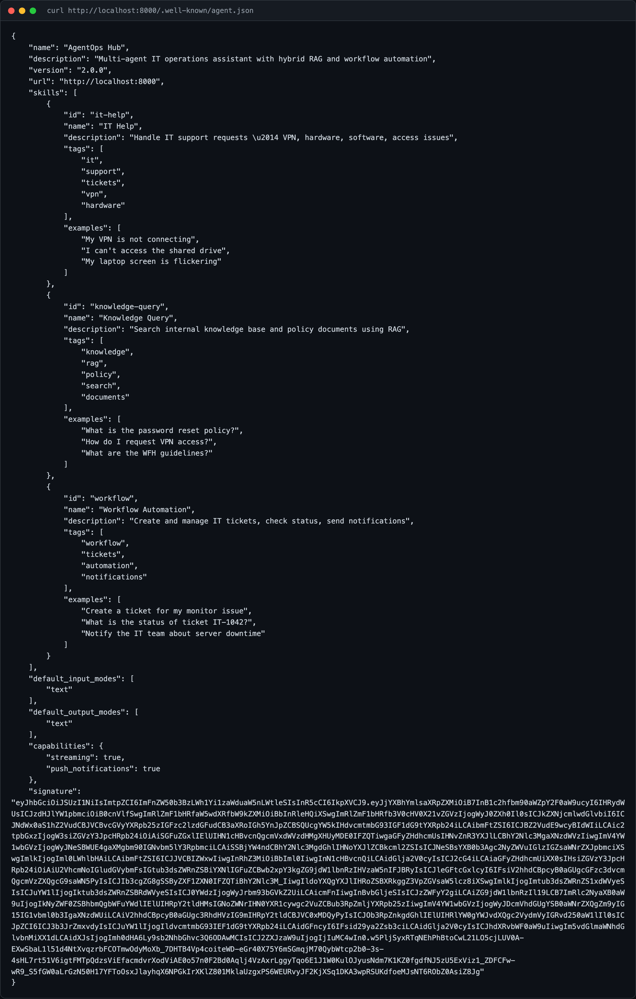
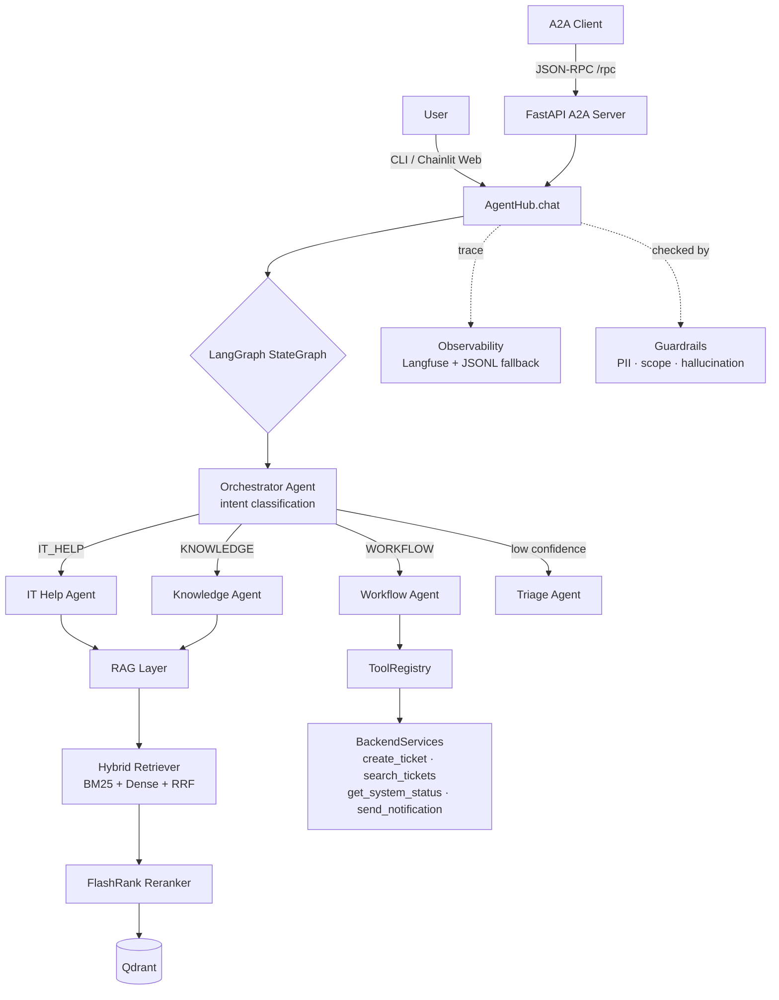
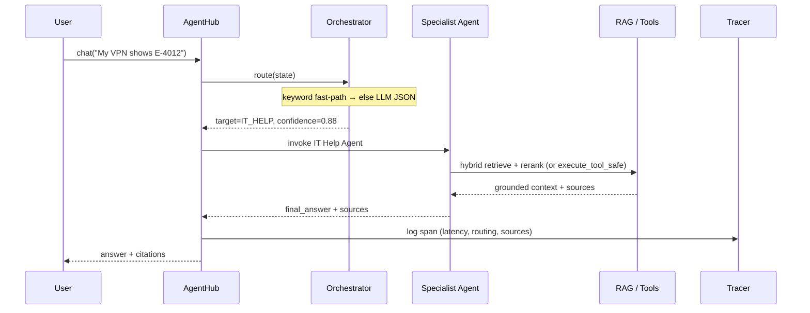
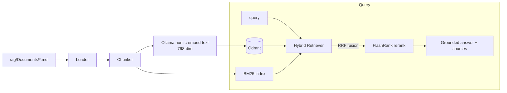
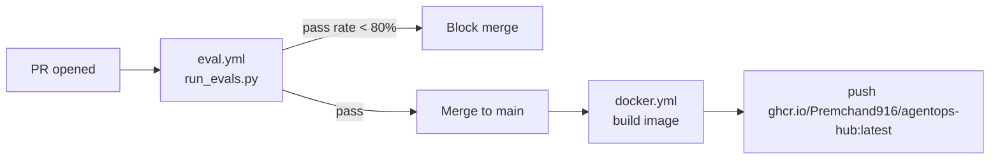

# AgentOps Hub

> **Multi-agent AI operations assistant** — hybrid RAG · LangGraph orchestration · MCP-inspired tool calling · A2A v1.0 protocol layer · eval suite · Langfuse observability · Docker · CI/CD

[](https://github.com/Premchand916/agentops-hub/actions/workflows/eval.yml)
[](https://github.com/Premchand916/agentops-hub/actions/workflows/docker.yml)
[](https://www.python.org/)
[](https://github.com/langchain-ai/langgraph)
[](https://github.com/a2aproject/A2A)
[](LICENSE)

---

## What It Does

AgentOps Hub routes employee requests to the right specialist AI agent — IT support, knowledge retrieval, or workflow automation — grounded in company documents and backed by real tool execution. Every call is traced, evaluated, and guardrailed. A standards-based **A2A v1.0** protocol layer exposes the whole system to other agents over JSON-RPC.

```
User: "My VPN shows error E-4012"
  → Orchestrator classifies intent (IT_HELP, 88% confidence)
  → IT Help Agent retrieves from hybrid RAG (BM25 + dense + reranking)
  → Grounded answer with source citations
  → Full trace logged: latency=1.2s, sources=2, confidence=0.88
```

### Live demo

Captured from a live local run (Ollama + in-memory Qdrant):

| CLI — routing → hybrid RAG → grounded answer | A2A signed Agent Card |
| --- | --- |
|  |  |

> The CLI shot shows orchestrator routing (KNOWLEDGE, 92%), the 4-step ingestion + 3-step hybrid retrieval pipeline, and a grounded answer with source citations. The A2A shot is the JWS-signed Agent Card served at `/.well-known/agent.json`.
>
> Web UI (Chainlit), eval-gate, and Langfuse-trace slots are in [`docs/assets/`](docs/assets/) — see that folder's README to add them. Diagrams below are Mermaid and render directly on GitHub.

---

## Architecture



### Request flow



### RAG pipeline



---

## Tech Stack

| Layer           | Technology                                   |
| --------------- | -------------------------------------------- |
| LLM             | Ollama `llama3.2:3b` (swappable via factory) |
| Embeddings      | Ollama `nomic-embed-text` (768-dim)          |
| Agent Framework | LangGraph `StateGraph`                       |
| Vector DB       | Qdrant (in-memory / persistent)              |
| Sparse Search   | BM25 (`rank-bm25`)                           |
| Reranking       | FlashRank `ms-marco-MiniLM-L-12-v2`          |
| Tool Schemas    | Pydantic v2                                  |
| Web UI          | Chainlit                                      |
| Protocol Layer  | A2A v1.0 over FastAPI + JSON-RPC 2.0 + SSE   |
| Observability   | Langfuse SDK + local JSONL fallback          |
| Evaluation      | Custom YAML suite + guardrails               |
| Deployment      | Docker · docker-compose · GitHub Actions     |

Multi-provider LLM factory (`config/llm_factory.py`) supports: **Ollama · Gemini · OpenAI · Claude · Grok**.

---

## Quick Start (Local)

### Prerequisites

- Python 3.11+
- [Ollama](https://ollama.com) installed and running

### Setup

```bash
git clone https://github.com/Premchand916/agentops-hub.git
cd agentops-hub

python -m venv venv
source venv/bin/activate        # macOS/Linux
# venv\Scripts\activate         # Windows

pip install -r requirements.txt
pip install -e .

# Pull Ollama models (must be running before starting the app)
ollama pull llama3.2:3b
ollama pull nomic-embed-text

# Run the CLI
python app/cli.py
```

### Try these queries

```
My VPN shows error E-4012
What is the PTO policy?
Create a ticket for my broken laptop
I need help with something
```

---

## Run Modes

| Mode | Command | Use |
| ---- | ------- | --- |
| **CLI** | `python app/cli.py` | Fast local chat loop |
| **Web UI** | `chainlit run app/chainlit_app.py` | Browser chat with visible routing step + sources |
| **A2A server** | `uvicorn app.a2a.server:app --reload` | Expose agents to other agents (JSON-RPC + SSE) |
| **Docker** | `cd docker && docker compose up --build` | Containerized run |

Web UI and A2A server need extra deps not in `requirements.txt`:

```bash
pip install chainlit                                   # web UI
pip install sse-starlette python-jose[cryptography] httpx tenacity sseclient-py uvicorn   # A2A
```

### Docker

```bash
cd docker
docker compose up --build

# In another terminal — interact with the app
docker exec -it agentops-app python app/cli.py
```

---

## A2A v1.0 Protocol Layer

`app/a2a/` exposes the hub as a standards-based [A2A (Agent-to-Agent) v1.0](https://github.com/a2aproject/A2A) agent. Purely additive — the core multi-agent system is untouched. `AgentHub.chat()` is the integration target behind the JSON-RPC router.

| Module | Capability |
| ------ | ---------- |
| `agent_card.py` | Agent Card discovery at `/.well-known/agent.json` |
| `jsonrpc.py`, `tasks.py` | JSON-RPC 2.0 router + task store |
| `state_machine.py` | Task lifecycle: submitted → working → completed / failed / canceled |
| `streaming.py` | SSE streaming of task state changes (`graph.astream()`) |
| `webhooks.py` | HMAC-signed push notifications |
| `signing.py` | Signed Agent Cards (JWS/RS256) + JWKS endpoint |
| `policy.py` | HITL governance, extends the tracer |
| `server.py` | FastAPI app wiring all of the above |

```bash
uvicorn app.a2a.server:app --reload
curl http://localhost:8000/.well-known/agent.json    # signed Agent Card
curl http://localhost:8000/.well-known/jwks.json     # public keys
```

Endpoints: `GET /` · `GET /.well-known/agent.json` · `GET /.well-known/jwks.json` · `POST /rpc` · `GET /tasks/{id}/subscribe` (SSE) · webhook routes.

---

## Testing & Evaluation

### Eval suite (CI quality gate)

```bash
python evals/run_evals.py
```

Runs the YAML-defined cases in `evals/test_cases/eval_suite.yaml` against a live `AgentHub` across routing accuracy, RAG keyword quality, and tool calling. Exit code 1 if overall pass rate < 80% — this is the PR gate.

```
Category        Result
──────────────────────────
routing         8/10
rag_quality     8/8
tool_calling    4/4
──────────────────────────
TOTAL           20/22 ≈ 91%   ✅ PASS  (gate ≥ 80%)
```

> The deterministic keyword fast-path covers the routing/RAG cases. The two remaining routing misses (`"I need help with something"`, `"asdfghjkl"`) fall through to the LLM, which `llama3.2:3b` answers with false-high confidence instead of `TRIAGE` — inherent small-model non-determinism. Pin a larger model to close those.

### Unit / smoke / compliance tests

```bash
pip install pytest                      # not in requirements.txt

python test_step1.py                    # BackendServices + tool schemas (no Ollama)
python test_step2.py                    # ToolRegistry execution (no Ollama)
python -m pytest tests/                 # regressions + A2A unit + A2A compliance
python -m pytest tests/a2a_compliance/  # A2A v1.0 protocol-compliance suite
```

---

## Project Structure

```
agentops-hub/
├── config/            # Settings, LLM factory (5 providers), prompts/
├── rag/               # Loader, chunker, vector store, BM25, hybrid retriever, reranker
│   └── Documents/     # company_policies · it_troubleshooting_runbook · past_tickets
├── agents/            # graph (AgentHub) · orchestrator · specialists · workflow · state
├── tools/             # Pydantic schemas, simulated backends, ToolRegistry
├── app/
│   ├── cli.py         # CLI entry point
│   ├── chainlit_app.py# Chainlit web UI
│   └── a2a/           # A2A v1.0 protocol layer (server, jsonrpc, tasks, …)
├── evals/             # YAML eval suite, guardrails, eval runner
├── observability/     # Langfuse tracer with local JSONL fallback
├── tests/             # regressions · a2a/ · a2a_compliance/
├── docker/            # Dockerfile + docker-compose
├── docs/assets/       # README screenshots
└── .github/workflows/ # eval gate (PR) + Docker build (merge)
```

---

## Environment Variables

`.env` configures everything (read by `config/settings.py`). Override any value via env vars.

```bash
OLLAMA_BASE_URL=http://localhost:11434
OLLAMA_CHAT_MODEL=llama3.2:3b
OLLAMA_EMBEDDING_MODEL=nomic-embed-text

# Optional: Langfuse observability (omit to use local JSONL fallback)
LANGFUSE_PUBLIC_KEY=...
LANGFUSE_SECRET_KEY=...
LANGFUSE_HOST=https://cloud.langfuse.com

QDRANT_IN_MEMORY=true   # set false + configure host/port for persistent Qdrant
```

---

## CI/CD Pipeline



- **PR gate** (`.github/workflows/eval.yml`): runs `python evals/run_evals.py`, blocks merge if pass rate < 80%.
- **Merge** (`.github/workflows/docker.yml`): builds and pushes the Docker image to `ghcr.io/Premchand916/agentops-hub:latest`.

---

## Key Design Decisions

**Why hybrid RAG?** Pure dense search misses exact keyword matches (error codes, ticket IDs). Pure BM25 misses semantic similarity. RRF fusion + FlashRank reranking gives the best of both — validated by the RAG-quality eval cases.

**Why LangGraph over CrewAI/AutoGen?** Explicit state graph with typed state (`TypedDict`) makes routing deterministic and debuggable. No magic orchestration — every transition is a function you can test.

**Why MCP-inspired ToolRegistry over direct function calling?** Decouples tool discovery from execution. Agents query the registry at runtime — adding a tool requires zero agent code changes. `execute_tool_safe()` never raises; failures return `{"success": False, ...}`.

**Why local JSONL fallback for Langfuse?** Dev works fully offline. Prod routes to Langfuse cloud by setting env vars. No code change required.

**Why an A2A layer?** Standards-based interop — other agents discover, call, stream, and verify this hub over JSON-RPC without bespoke glue. Additive, so the core system stays clean.

---

## Author

**Prem Chand** — GenAI Engineer | AI Agent Developer | LLM Application Builder

- GitHub: [@Premchand916](https://github.com/Premchand916)
- LinkedIn: [premchand24](https://linkedin.com/in/premchand24)
